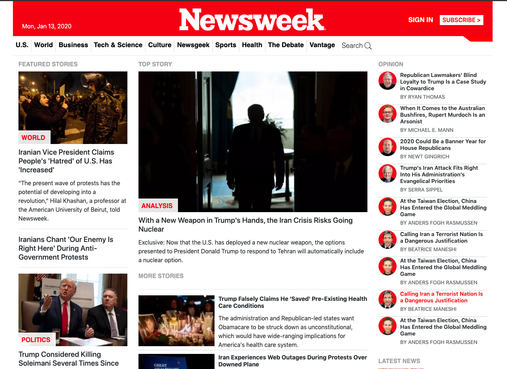

# NEWSWEEK Clone

> A clone of the [NEWSWEEK](https://www.newsweek.com/) page.

This project is a clone of the Newsweek website. The aim of the project is to use Bootstrap to clone a website, and learn Bootstrap.

## Built With

- HTML
- CSS
- Bootstrap

## Live Demo

[https://trodrige.github.io/newsweek-clone/](https://trodrige.github.io/newsweek-clone/)

## Getting Started

**Download this project and use your favorite web brower to open the index.html to see how it looks like.**

## Authors

👤 **Tigpezeghe Rodrige K.**
- Github: [@Trodrige](https://github.com/Trodrige)
- Twitter: [@TRodrige](https://twitter.com/TRodrige)
- LinkedIn: [Linkedin](https://www.linkedin.com/in/tigpezeghe-rodrige-k-52472310b/)

## 🤝 Contributing

Contributions, issues and feature requests are welcome!

Feel free to check the [issues page](https://github.com/trodrige/newsweek-clone/issues).
